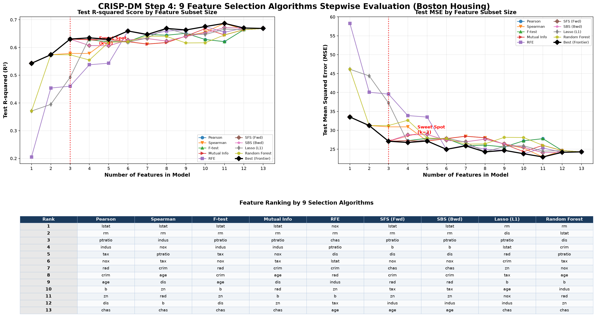

# AI Boston 房價預測與特徵選擇系統

此專案使用 Boston Housing 資料集來比較 9 種特徵選擇演算法在回歸問題中的表現。

## 目標

預測 `medv`（房屋估價中位數），並評估不同的特徵子集數量對模型預測表現的影響。

## 主要輸出結果



## 工作流程

1. 載入 Boston Housing 資料集
2. 進行資料清理與檢查
3. 執行 9 種特徵選擇演算法
4. 評估特徵子集（k=1 到 k=13）的預測表現
5. 比較測試集上的 $R^2$ (Test R²) 與 均方誤差 (Test MSE)
6. 產生整合型分析圖表 (`feature_selection_performance_allinone.png`)

## 特徵選擇方法

| # | 方法 | 說明 |
|---|--------|-------------|
| 1 | Pearson Corr | Pearson 相關係數排序 |
| 2 | Spearman Corr | Spearman 等級相關係數排序 |
| 3 | F-test Reg | 回歸問題的 F-test 檢定 |
| 4 | Mutual Info | 互資訊 (Mutual Information) 回歸 |
| 5 | RFE | 遞迴特徵消除法 (Recursive Feature Elimination) |
| 6 | SFS (Forward) | 循序前向選擇法 (Sequential Forward Selection) |
| 7 | SBS (Backward) | 循序後向選擇法 (Sequential Backward Selection) |
| 8 | Lasso (L1) | Lasso L1 正則化係數大小排序 |
| 9 | Random Forest | 隨機森林特徵重要性 (Feature Importance) |

## 評估指標

- **$R^2$** (判定係數/解釋力)：越高越好
- **MSE** (均方誤差)：越低越好

## 執行方式

安裝必要套件：

```bash
pip install -r requirements.txt
```

執行特徵選擇與圖表生成腳本：

```bash
python scripts/generate_feature_selection_chart.py
```

自訂參數執行：

```bash
python scripts/generate_feature_selection_chart.py \
  --data data/boston_housing.csv \
  --output reports/figures/feature_selection_performance_allinone.png \
  --sweet-k 3 \
  --save-results
```

## 專案結構

```
boston-housing-feature-selection/
├── README.md
├── requirements.txt
├── data/
│   └── boston_housing.csv
├── src/
│   ├── __init__.py
│   ├── data_loader.py
│   ├── preprocessing.py
│   ├── feature_selection.py
│   ├── model_evaluation.py
│   └── visualization.py
├── scripts/
│   └── generate_feature_selection_chart.py
├── reports/
│   └── figures/
│       └── feature_selection_performance_allinone.png
└── docs/
```

## 資料集欄位說明

| 特徵 | 說明 |
|---------|-------------|
| CRIM | 城鎮人均犯罪率 (Per capita crime rate by town) |
| ZN | 住宅用地比例 (Proportion of residential land zoned for large lots) |
| INDUS | 非零售商業用地比例 (Proportion of non-retail business acres per town) |
| CHAS | 查爾斯河虛擬變數 (Charles River dummy variable, 鄰河為 1，否則為 0) |
| NOX | 一氧化氮濃度 (Nitric oxides concentration) |
| RM | 每棟住宅的平均房間數 (Average number of rooms per dwelling) |
| AGE | 1940年前建造的自住單位比例 (Proportion of owner-occupied units built before 1940) |
| DIS | 到波士頓五個就業中心的加權距離 (Weighted distances to employment centers) |
| RAD | 聯外放射狀高速公路的便利指數 (Index of accessibility to radial highways) |
| TAX | 每10,000美元的全額財產稅率 (Property tax rate) |
| PTRATIO | 城鎮師生比例 (Pupil-teacher ratio by town) |
| B | 黑人人口比例相關指標 (Legacy demographic variable) |
| LSTAT | 社會經濟地位較低人口比例 (Percentage of lower status population) |
| MEDV | 目標變數：自住房屋中位數價值 (Target: median value of owner-occupied homes, 單位: $1000) |

## 倫理聲明與注意事項

Boston Housing 資料集為經典機器學習教學資料集，但其含有過時且具爭議性的社會變數（例如 `B` 與 `LSTAT`）。本專案僅供學術教育、演算法比較與視覺化練習之用，不應將分析結果作為真實房地產投資或商業決策的依據。
